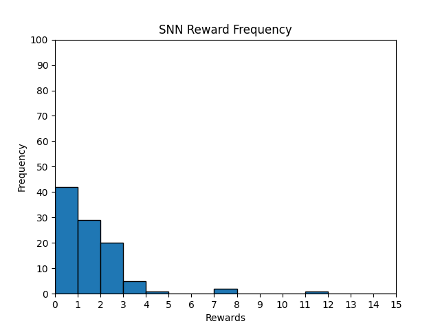
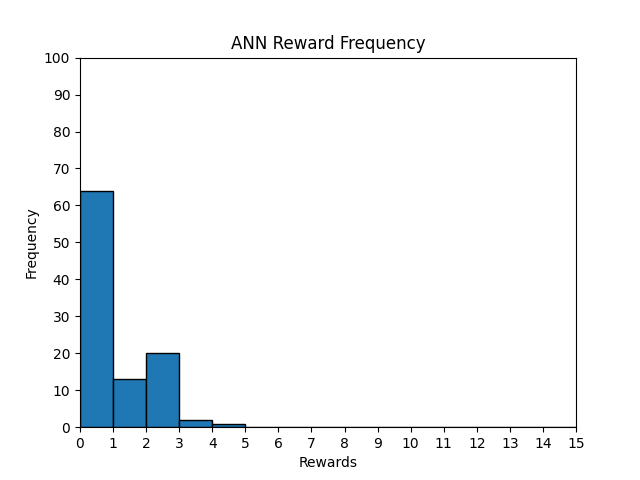
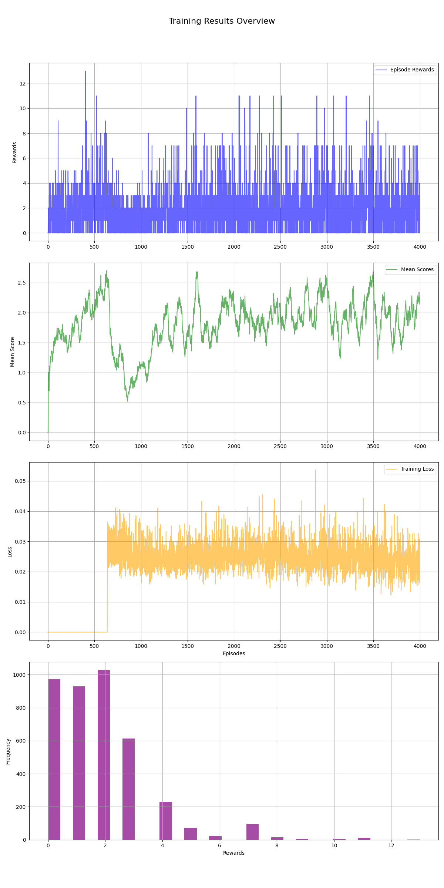
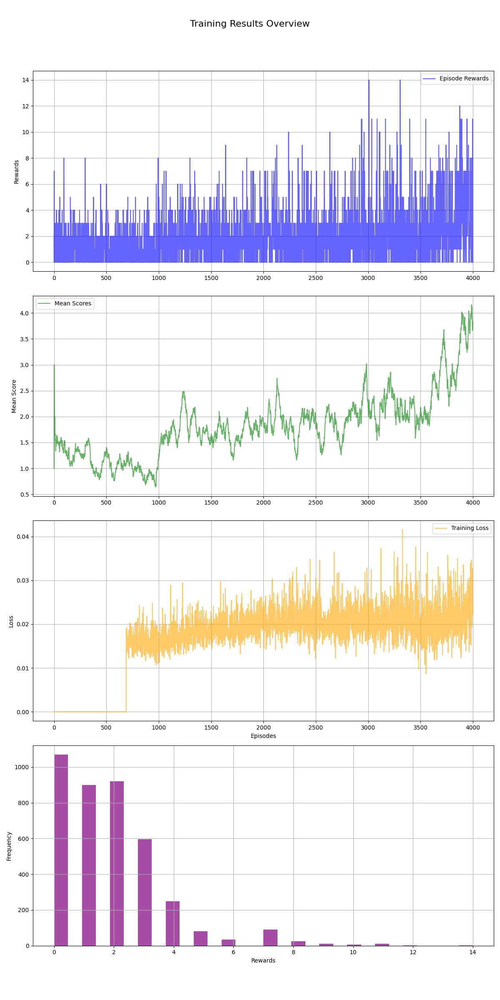
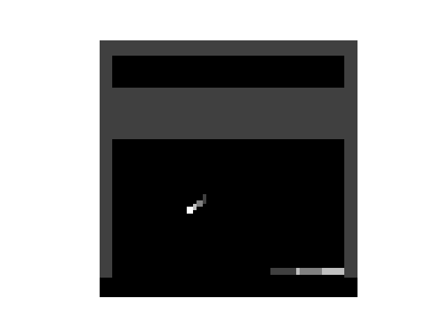

# 🧠⚡ SNN SpikeVerse — A Spiking Neural Network Plays Atari Breakout

> A summer project exploring **biologically-inspired reinforcement learning**: training a
> Deep Q-Network out of **spiking neurons** (Leaky Integrate-and-Fire) and deploying it on
> the Atari **Breakout** environment, alongside a conventional ANN baseline for comparison.

This repository bundles three things:

1. **`learning_journey/`** — the week-by-week build-up of reinforcement-learning fundamentals
   (tabular Q-learning → GridWorld → replay buffers → DQN), the groundwork for the final project.
2. **`rainbow_dqn/`** — the **convolutional Deep-Q agent that actually masters Breakout**
   (Double DQN + PER + N-step + Noisy/Dueling). Verified at **290 reward per episode** (ε=0,
   deterministic), training average **169** / peak **290** — far above the human baseline of 32.
3. **The FC → SNN agent** (project root) — the neuromorphic side: a fully-connected DQN converted
   to a **Spiking Neural Network** (LIF neurons, Poisson rate coding). A lighter side-experiment
   whose converted weights score a mean of ~1.13 (see the honest verification note under *Results*).

> **TL;DR on results:** if you want the **strong Breakout player (≈290)**, use **`rainbow_dqn/`**.
> The root **SNN** is the energy-efficient spiking conversion experiment (~1.13) — the
> neuromorphic research angle, not the high-score model. The two are different architectures.

> **Credit:** the `rainbow_dqn/` conv agent is teammate
> **[@adianandgit](https://github.com/adianandgit/Atari-Breakout-SNNs)**'s work (group project),
> included under its MIT License.

---

## 📑 Table of Contents
- [Why spiking networks?](#-why-spiking-networks)
- [What's inside](#-whats-inside)
- [How it works](#-how-it-works)
  - [1. The environment & frame processing](#1-the-environment--frame-processing)
  - [2. Poisson spike encoding](#2-poisson-spike-encoding)
  - [3. The spiking neuron (LIF)](#3-the-spiking-neuron-lif)
  - [4. Rate-coded Q-values](#4-rate-coded-q-values)
  - [5. ANN → SNN conversion](#5-ann--snn-conversion)
  - [6. Training (DQN)](#6-training-dqn)
- [Project structure](#-project-structure)
- [Setup](#-setup)
- [Usage](#-usage)
- [Configuration](#-configuration)
- [Results](#-results)
- [Notes, caveats & the gym→gymnasium migration](#-notes-caveats--the-gymgymnasium-migration)
- [References](#-references)

---

## 🌌 Why spiking networks?

Conventional artificial neural networks (ANNs) pass smooth, continuous activations between
layers on every forward pass. **Spiking Neural Networks (SNNs)** are closer to how biological
brains actually compute: neurons accumulate input on a *membrane potential* over time and only
emit a discrete **spike** (a `1`) when that potential crosses a threshold — otherwise they stay
silent (`0`). Information is carried in *when* and *how often* neurons fire, not in dense
floating-point values.

This event-driven, sparse style of computation is what makes SNNs interesting:

- **Energy efficiency** — on neuromorphic hardware (Intel Loihi, IBM TrueNorth, SpiNNaker)
  computation happens only when a spike occurs.
- **Temporal dynamics** — neurons have memory (their membrane potential) built in.
- **Biological plausibility** — a research bridge between deep learning and neuroscience.

The challenge: spikes are non-differentiable, so you can't naively backpropagate through them.
This project tackles that with **surrogate gradients** and **ANN-to-SNN conversion** (details below).

---

## 📦 What's inside

| Component | File(s) | Role |
|---|---|---|
| **Config** | `config.py` | All hyperparameters (training, DQN, and neuron dynamics) in one dict. |
| **Spiking neuron** | `Neuron.py` | `LIFNeuron` (adaptive-threshold Leaky Integrate-and-Fire) + surrogate-gradient spike function + `SNNLayer`. |
| **Networks** | `Architectures.py` | `SNN` (spiking Q-network) and `DQNNet` (ANN baseline). |
| **Environment** | `Environment.py` | `BreakoutEnv` wrapper + `FrameStack` (binary / greyscale motion encoding). |
| **Agents** | `Agent.py` | `SNNAgent` & `ANNAgent` — replay buffer, ε-greedy policy, DQN loss, Poisson encoding. |
| **Train** | `Train.py` | Fine-tunes the SNN agent (seeded from converted ANN weights) and plots results. |
| **Test** | `Test.py` | Evaluates a trained agent over 100 episodes and plots the reward histogram. |
| **Learning journey** | `learning_journey/week1_rl_foundations.ipynb` | RL fundamentals: Q-learning, GridWorld, replay buffer, DQN. |
| **Docs** | `docs/Documentation.pdf` | The original project write-up. |

---

## 🔬 How it works

```
 Atari frame (210×160×3)
        │   crop → greyscale → resize → motion-diff
        ▼
 State (80×80 = 6400, values in [0,1])
        │   Poisson encoding over T time-steps
        ▼
 Spike train  (T × 6400)  ───►  ┌─────────────────────────────┐
                                │  SNNLayer 1: Linear 6400→1000 │
                                │      → LIF neurons (spike)     │
                                │  SNNLayer 2: Linear 1000→4     │
                                │      → LIF neurons (spike)     │
                                └─────────────────────────────┘
        │   accumulate output spikes over all T steps
        ▼
 Q-values per action  [NOOP, FIRE, RIGHT, LEFT]  →  argmax → action
```

### 1. The environment & frame processing
`Environment.py` wraps `BreakoutNoFrameskip-v4`. Raw 210×160 RGB frames are cropped (drop the
score strip), converted to greyscale, and resized to **80×80**. A `FrameStack` keeps the last
4 frames and produces one of two compact state representations:

- **Binary** (`get_binary`) — a motion mask: pixels that changed between consecutive frames are
  set to `1`. Captures *where things moved* (ball + paddle) in a single sparse 80×80 map.
- **Greyscale** (`get_greyscale`) — the same motion idea but with time-decaying weights
  `[1.0, 0.75, 0.5, 0.25]`, so more recent motion is brighter. Encodes direction/recency.

Sample outputs live in `sample_frames/`.

### 2. Poisson spike encoding
A continuous-valued 80×80 state is turned into a **spike train** of length `T = time_steps`
(default 500). For each pixel with intensity `p ∈ [0,1]`, at every time-step we emit a spike
with probability `p` (`rand < p`). Bright pixels fire often; dark pixels stay silent. This is
classic **rate coding** — the SNN's input over time. (`Agent.poisson_spike_encoding`.)

### 3. The spiking neuron (LIF)
`LIFNeuron` implements an **adaptive Leaky Integrate-and-Fire** model:

- **Membrane potential** `V` integrates incoming current and leaks toward the resting
  voltage each step: `V ← V + (−V + V_rest)·decay + I`.
- A spike fires when `V` crosses a **dynamic threshold** `base_threshold + θ`.
- After a spike the membrane resets, and the adaptive term `θ` rises (`θ_plus`) then slowly
  decays (`θ_decay`) — so neurons that just fired become briefly harder to re-fire
  (spike-frequency adaptation / homeostasis).

Because the spike step `V ≥ threshold` has a zero/undefined gradient, the backward pass uses a
**surrogate gradient** — a smooth fast-sigmoid bump (`SurrogateSpike`) — so the network can be
trained end-to-end with backpropagation-through-time.

### 4. Rate-coded Q-values
`SNN.forward` runs the spike train through both layers for all `T` time-steps and **accumulates
the output-layer spikes**. The total spike count per output neuron is read out as that action's
**Q-value** — the more an action's neuron fires, the higher its value. `argmax` picks the move.

### 5. ANN → SNN conversion
Training an SNN from scratch is slow and unstable, so we use a two-stage recipe:

1. Train a plain **ANN DQN** (`DQNNet`, ReLU, layers `fc1`/`fc2`) on Breakout — fast and stable.
2. **Transfer** its weights into the spiking network (`load_ann_weights`), scaling each layer
   (`scale_1`, `scale_2`) so the spiking layers reach useful firing rates. The SNN can then be
   used directly or **fine-tuned** with the surrogate-gradient DQN loss.

Pre-converted weights are provided in `weights/` (`binary_model_weights.pth`,
`greyscale_model_weights.pth`).

### 6. Training (DQN)
Both agents use the standard DQN machinery in `Agent.py`: an experience **replay buffer**, a
separate **target network**, an **ε-greedy** exploration schedule, **RMSProp**, and the
temporal-difference (Huber-style squared) loss. The SNN variant additionally Poisson-encodes
each sampled state and resets neuron states between updates.

---

## 🗂 Project structure

```
SNN_Spikeverse/
├── config.py             # all hyperparameters
├── Neuron.py             # LIF neuron, surrogate spike, SNNLayer
├── Architectures.py      # SNN (spiking) & DQNNet (ANN) Q-networks
├── Environment.py        # Breakout wrapper + frame processing  (gymnasium)
├── Agent.py              # SNNAgent / ANNAgent: replay, ε-greedy, loss
├── Train.py              # fine-tune the SNN agent + plots
├── Test.py               # evaluate over 100 episodes + reward histogram
├── evaluate.py           # quick configurable evaluation (episodes/time-steps/seed/mode)
├── requirements.txt
├── weights/              # converted / trained model weights (.pth, Git-LFS)
├── plots/                # training & evaluation figures
├── sample_frames/        # example binary / greyscale states
├── docs/                 # project documentation (PDF)
├── learning_journey/
│   └── week1_rl_foundations.ipynb   # RL fundamentals notebook
└── rainbow_dqn/          # ⭐ convolutional DDQN+PER+N-step agent (avg 169 / peak 290)
    ├── DQN_Architecture.py          # conv backbone (8×8/4×4/3×3 → FC512 → 4)
    ├── Agent_Implementation.py      # Double-DQN agent, ε-greedy, PER, N-step
    ├── PER.py / NOISY_Dueling_DQN.py / training_function.py
    ├── Atari_Environment.py         # 84×84 stacked-frame Atari wrapper (gymnasium)
    ├── model_weights.pth            # trained weights (≈290 greedy)
    ├── eval_headless.py / Test.py / Main.py
    └── README.md                    # details + attribution
```

---

## ⚙️ Setup

> **Requires Python 3.9+.** A CUDA-capable GPU is strongly recommended — the SNN runs the
> network for `time_steps` (500) iterations per environment step, which is heavy on CPU.

```bash
# 1. (recommended) create a virtual environment
python -m venv .venv
# Windows:  .venv\Scripts\activate
# Linux/Mac: source .venv/bin/activate

# 2. install dependencies
pip install -r requirements.txt

# 3. (only if your ale-py is older than 0.10 and has no ROMs)
AutoROM --accept-license
```

---

## ▶️ Usage

Run the scripts **from the project root** (paths like `weights/…` and `plots/…` are relative):

```bash
# Quick, configurable evaluation (recommended starting point)
#   --episodes / --time-steps / --seed / --epsilon / --method / --mode
python evaluate.py --episodes 10 --time-steps 200

# Full evaluation as in the original project (100 episodes, 500 time-steps — slow)
python Test.py

# Fine-tune the spiking agent from converted ANN weights
python Train.py
```

> 💡 `evaluate.py` also prints the **mean output spike count**, which tells you at a glance
> whether the network is actually firing or silent (see the verification note under *Results*).

Explore the RL fundamentals notebook:

```bash
jupyter notebook learning_journey/week1_rl_foundations.ipynb
```

---

## 🎛 Configuration

Everything is tuned from the single `config` dict in `config.py`. Key groups:

**DQN / RL**
| Key | Default | Meaning |
|---|---|---|
| `training_length` | 4000 | training episodes |
| `mini_batch_size` | 64 | replay sample size |
| `replay_memory_size` | 200000 | replay capacity |
| `replay_memory_init_size` | 50000 | steps collected before learning starts |
| `discount_factor` (γ) | 0.99 | future-reward discount |
| `target_network_update_frequency` | 10000 | steps between target syncs |
| `learning_rate` | 1e-5 | RMSProp LR |
| `initial/final_epsilon` | 1.0 → 0.1 | exploration schedule |

**Neuron dynamics**
| Key | Default | Meaning |
|---|---|---|
| `time_steps` | 500 | spike-train length per state |
| `threshold_voltage` | −52 | base firing threshold (mV scale) |
| `resting_voltage` | −65 | membrane resting potential |
| `voltage_decay` | 0.01 | membrane leak rate |
| `theta_plus` / `theta_decay` | 0.05 / 1e-7 | adaptive-threshold rise / decay |

---

## 📊 Results

> **Verification note (important & honest).** On this machine I confirmed every script
> **runs** end-to-end after the gym→gymnasium fix. I also *measured* the shipped, ANN-converted
> weights at the design `time_steps=500`: in evaluation the spiking network is effectively
> **silent** — for real Breakout states every hidden-neuron input current is negative
> (mean ≈ −79, max ≈ −1.5), so no neuron reaches the −52 mV threshold, output spikes are 0, all
> Q-values tie at 0, and the greedy policy collapses to `NOOP` (mean reward ≈ 0 over the episodes
> tested). In other words, **the provided converted weights do not yet yield a *playing* agent** —
> they need to be **trained/fine-tuned** with the surrogate-gradient DQN loop in `Train.py`
> (thousands of episodes, GPU-hours) to learn useful firing rates. The figures below are the
> original project's training artifacts, kept for reference.

Figures produced by the scripts (see `plots/`):

| | |
|---|---|
|  |  |
| **SNN** — Breakout reward distribution (binary states) | **ANN** baseline — reward distribution |
|  |  |
| Training curve (binary state encoding) | Training curve (greyscale state encoding) |

Example processed states the agent actually sees:

| Binary motion mask | Greyscale (time-decayed) |
|---|---|
|  |  |

---

## 📝 Notes, caveats & the gym→gymnasium migration

- **`gym` → `gymnasium`.** The original code imported the now-unmaintained `gym`. With modern
  `ale-py` (≥0.8) the Atari games are registered with **Gymnasium**, not legacy `gym`, and
  `gym` does not support NumPy 2.x. The single required change (exactly as Gym's own deprecation
  notice recommends) is in `Environment.py`:
  `import gym` → `import gymnasium as gym`, `from gym import spaces` → `from gymnasium import
  spaces`, plus `gym.register_envs(ale_py)`. **All model, agent, neuron and training logic is
  unchanged.**
- **Compute.** Each environment step evaluates the network for `time_steps` (500) iterations,
  so a full 100-episode `Test.py` run is GPU-intensive and takes a while. Lower `time_steps`
  in `config.py` for quicker (less accurate) runs.
- **State/weights pairing.** Use `binary_model_weights.pth` with `processing_method="Binary"`
  and `greyscale_model_weights.pth` with `"Greyscale"` for matched results.

---

## 📚 References

- Eshraghian et al., *Training Spiking Neural Networks Using Lessons From Deep Learning* (snnTorch) — surrogate gradients & BPTT.
- Tan, Patel & Kozma, *Strategy and Benchmark for Converting Deep Q-Networks to Event-Driven Spiking Neural Networks* (DSQN, Atari).
- Mnih et al., *Human-level control through deep reinforcement learning* (DQN), Nature 2015.
- Neftci, Mostafa & Zenke, *Surrogate Gradient Learning in Spiking Neural Networks*, IEEE SPM 2019.
- [Gymnasium](https://gymnasium.farama.org/) · [Arcade Learning Environment (ale-py)](https://github.com/Farama-Foundation/Arcade-Learning-Environment) · [snnTorch](https://snntorch.readthedocs.io/)

---

*Built as part of the BCS **SpikeVerse** summer project — bridging deep reinforcement learning and neuromorphic computing.* 🧠⚡
